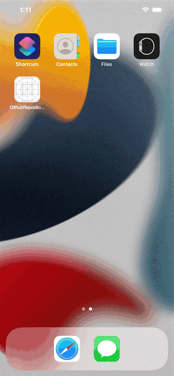

# Requirements

* iOS ~> 15.0
* Swift ~> 5
* Sourcery ~> 1.7.0
* SwiftLint
* CocoaPods

```bash
$ brew install swiftlint sourcery
$ sudo gem install cocoapods
$ cd {path/to/project-root}
$ pod install
```

# Dependencies

* Moya/Combine
* Resolver
* SwiftLint

## For testing

* Quick
* Nimble
* SwiftyMocky
* CombineExpectations

# Preview

